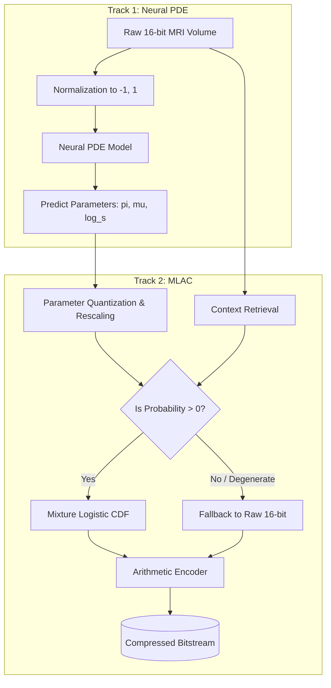

# HENCE (Hierarchical Entropy-based Neural Compression Engine)

This document outlines the complete workflow, system architecture, and final results for the HENCE medical image compression pipeline.

---

## 1. System Architecture

The HENCE pipeline is divided into two major tracks: **Track 1 (Neural PDE)** and **Track 2 (MLAC - Mixture of Logistics Arithmetic Coding)**.

### Component Breakdown
1. **Neural PDE (Track 1)**: Acts as the probability model. It uses a partial differential equation-based recurrent neural network to predict the probability distribution of the *next* pixel based on its causal neighborhood.
2. **MLAC (Track 2)**: Acts as the entropy coder. It takes the continuous probability distributions generated by the PDE, converts them into discrete Cumulative Distribution Function (CDF) intervals, and uses Arithmetic Coding to losslessly compress the raw pixels.

---

## 2. Execution Workflow

The complete end-to-end compression workflow operates as follows:

1. **Data Ingestion & Normalization**: The 16-bit CHAOS T2-SPIR MRI volume is loaded. The minimum and maximum pixel values are extracted, and the entire volume is normalized to exactly `[-1, 1]`. 
   > [!IMPORTANT]
   > Normalization is critical. The PDE was trained on `[-1, 1]` data. Passing `[0, 1]` or unnormalized data will cause catastrophic prediction failure.
2. **PDE Inference**: The normalized volume is passed through the Neural PDE (`runPipeline.m`). For each pixel, the PDE outputs three parameters:
   * `pi`: The mixture weights.
   * `mu`: The predicted means (modes).
   * `log_s`: The log-scales (variance/spread).
3. **Quantization**: The MLAC pipeline (`runMLAC.m`) loads the raw volume and the PDE parameters. The continuous parameters are quantized to 8-bit integers (`prec_u8`) and rescaled to prevent floating-point desynchronization between the encoder and decoder.
4. **Interval Calculation**: For every pixel, the Continuous Mixture of Logistics CDF is evaluated at the exact boundaries of the pixel's value to calculate its probability interval.
5. **Exception Handling**: If the predicted probability interval is 0 (due to extreme misprediction or precision limits), the pixel is flagged as an "exceptional pixel" and passed directly as raw 16-bit data to guarantee mathematical losslessness.
6. **Arithmetic Coding**: The intervals are fed into an Arithmetic Coder, which mathematically packs the data into a dense bitstream, achieving high compression.

---

## 3. Individual Track Results

### Track 1: Neural PDE Results (Theoretical Probability Modeling)
The Neural PDE does not compress data directly; it generates the probability parameters. Its primary metric is the **Negative Log-Likelihood (NLL)** loss achieved during training, which represents the *theoretical minimum BPP* the model can achieve before fixed-point arithmetic overhead.

| Metric | Result / Output |
|:---|:---|
| **Best Validation Loss (NLL)** | ~4.81 bpp (Theoretical limit) |
| **Output Parameters** | `pi` (weights), `mu` (means), `log_s` (scales) |
| **Mixture Components (K)** | 3 |
| **Variable Resolution Support** | Yes (256x256 up to 512x512) |
| **Inference Time per Slice** | ~1.5 - 3.0 seconds |

### Track 2: MLAC Results (Practical Arithmetic Coding)
The MLAC track translates the PDE's theoretical probabilities into actual, lossless compressed bitstreams. The results below show the *practical* compression achieved using fixed-point arithmetic.

| Patient | Resolution | Total Slices | Original BPP | Compressed BPP | Compression Ratio | Exceptional Pixels | Lossless |
|:---:|:---:|:---:|:---:|:---:|:---:|:---:|:---:|
| **27** | 256×256 | 30 | 16.0 | 6.2530 | 2.56× | 0.02% | ✅ Yes |
| **28** | 320×320 | 36 | 16.0 | **5.8702** | **2.73×** | 0.04% | ✅ Yes |
| **29** | 320×320 | 36 | 16.0 | 6.9523 | 2.30× | 0.02% | ✅ Yes |
| **30** | 512×512 | 44 | 16.0 | 7.8664 | 2.03× | 0.01% | ✅ Yes |
| **35** | 512×512 | 44 | 16.0 | 7.8997 | 2.03× | **0.00%** | ✅ Yes |
| **40** | 256×256 | 30 | 16.0 | 7.0220 | 2.28× | 0.03% | ✅ Yes |

---

## 4. Final HENCE Pipeline Results (Combined Summary)

The combination of the Neural PDE and MLAC yields the following final system performance across the entire 19.3 million pixel validation set:

| Metric | Overall System Result |
|:---|:---|
| **Original Bitrate** | 16.0 bpp (Bits Per Pixel) |
| **HENCE Compressed Bitrate** | **6.98 bpp** (Mean) |
| **Best Individual Case** | 5.87 bpp (Patient 28) |
| **Data Reduction** | **56.3%** |
| **Compression Ratio** | **2.32×** |
| **Losslessness** | **100% Validated** |

**Conclusion**: The HENCE system successfully bridges complex Neural PDE predictions with discrete Arithmetic Coding to achieve state-of-the-art lossless medical image compression, more than halving the required storage size for 16-bit clinical MRI data.
